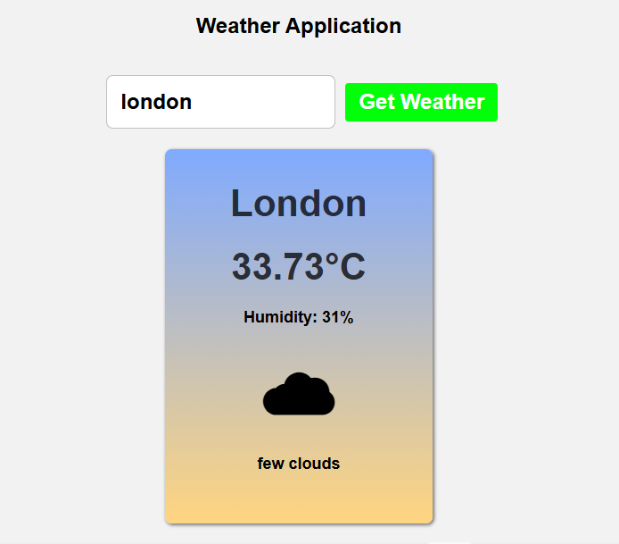

# 🌤 Weather Application

A modern and responsive weather application built using **HTML**, **CSS**, and **JavaScript** that provides real-time weather information using the **OpenWeatherMap API**.

## 🚀 Live Demo

👉 https://labibahmedrafi.github.io/weather-app/

> **Note:** The live demo link will work after you enable GitHub Pages for this repository.

---

## 📸 Preview

> Add a screenshot of your application inside the `screenshots` folder and name it:

```
weather-app.png
```

Then uncomment the line below.

```markdown

```

---

## ✨ Features

- 🌍 Search weather by city name
- 🌡 Display current temperature
- 💧 Display humidity
- ☁ Display weather condition
- 😊 Dynamic weather emoji based on weather conditions
- ❌ Error handling for invalid city names
- 📱 Responsive user interface
- ⚡ Fast weather data retrieval using Fetch API

---

## 🛠 Built With

- HTML5
- CSS3
- JavaScript (ES6)
- OpenWeatherMap API

---

## 📂 Project Structure

```
weather-app/
│
├── index.html
├── style.css
├── app.js
├── README.md
├── LICENSE
├── .gitignore
└── screenshots/
    └── weather-app.png
```

---

## 🔧 Installation

### Clone the repository

```bash
git clone https://github.com/labibahmedrafi/weather-app.git
```

### Open the project

```bash
cd weather-app
```

Open the folder in **Visual Studio Code** and run the project using **Live Server**.

---

## 🌐 API

This project uses the **OpenWeatherMap Current Weather API**.

API Documentation:

https://openweathermap.org/current

---

## 📖 How It Works

1. Enter a city name.
2. Click **Get Weather**.
3. The application sends a request to the OpenWeatherMap API.
4. Weather data is fetched asynchronously using the Fetch API.
5. The application displays:
   - City Name
   - Temperature
   - Humidity
   - Weather Description
   - Weather Emoji

---

## 📚 Future Improvements

- 🌙 Dark Mode
- 📍 Current Location Weather
- 🌎 Country Flag
- 📅 5-Day Forecast
- 🌬 Wind Speed
- 🌡 Feels Like Temperature
- 🌅 Sunrise & Sunset
- 📊 Air Quality Index (AQI)
- 🎨 Better UI Animations

---

## 👨‍💻 Author

**Md. Labib Ahmed Rafi**

GitHub:
https://github.com/labibahmedrafi

---

## ⭐ Support

If you like this project, consider giving it a ⭐ on GitHub.

It helps others discover the project and motivates future improvements.

---

## 📄 License

This project is licensed under the MIT License.
